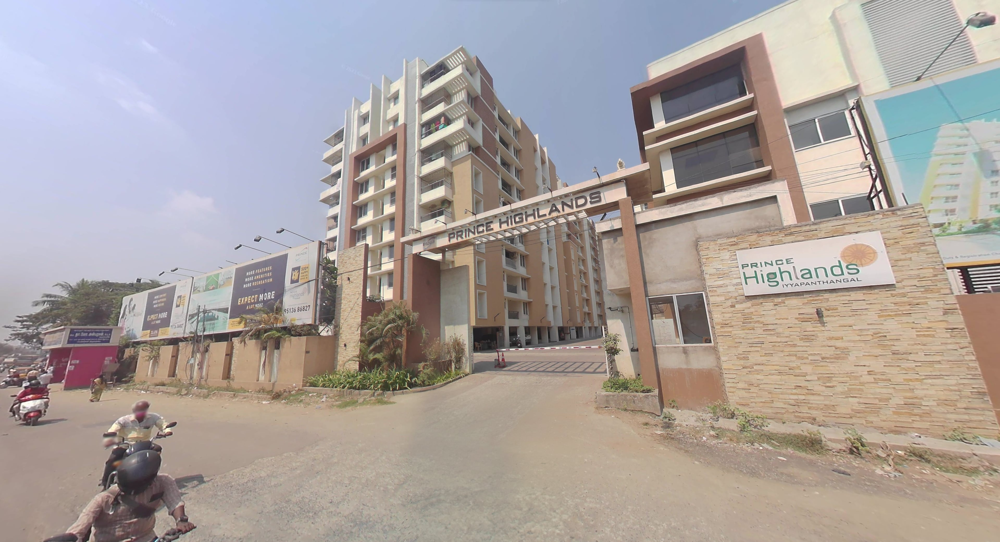

# Guide to contact Ajith

### Below are few ways to contact Ajith in case you found something that he lost

**Primary Phone Number** : [+91-9843993176](tel:+919843993176) &nbsp;&nbsp;&nbsp;-&nbsp;&nbsp;&nbsp;[Click here to open in WhatsApp](https://api.whatsapp.com/send?phone=919843993176)  
**Secondary Phone Number** : [+91-8838900570](tel:+918838900570) &nbsp;&nbsp;&nbsp;-&nbsp;&nbsp;&nbsp;[Click here to open in WhatsApp](https://api.whatsapp.com/send?phone=918838900570)  
**Father's Phone Number** : [+91-8220013707](tel:+918220013707) &nbsp;&nbsp;&nbsp;-&nbsp;&nbsp;&nbsp;[Click here to open in WhatsApp](https://api.whatsapp.com/send?phone=918220013707)  
**Ameer's Phone Number** : [+91-6382945860](tel:+916382945860) &nbsp;&nbsp;&nbsp;-&nbsp;&nbsp;&nbsp;[Click here to open in WhatsApp](https://api.whatsapp.com/send?phone=916382945860)  

**eMail ID** : [5554ajith@gmail.com](mailto:5554ajith@gmail.com)

**Location** : [Click here to show the location in Google Maps](https://goo.gl/maps/yzJ3Uo5X7z2WjVSt7)

In case you want to send the belongings via parcel/courier, please use the below address:

**Address:** *6A-904, Prince Highlands Apartment, Mount Poonamallee High Road, Iyyappanthangal, Chennai, Tamil Nadu, India - 600056 (Landmark: Near Ramachandra Hospital)*

### Google Maps Image

* * *
